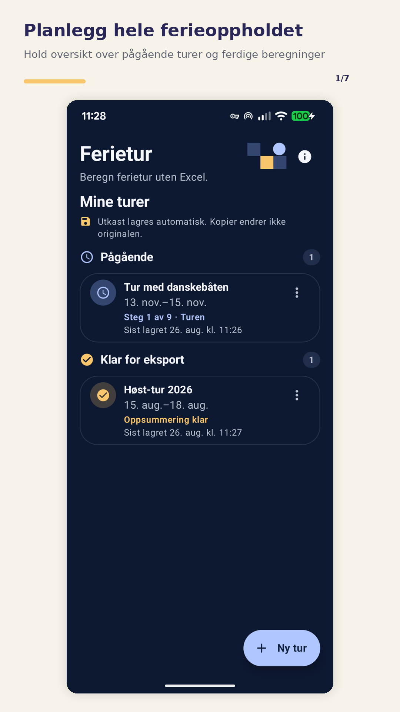
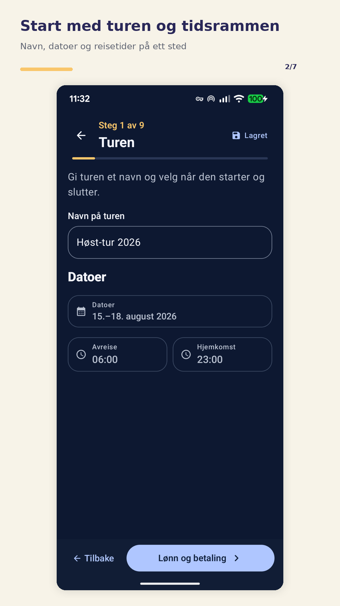
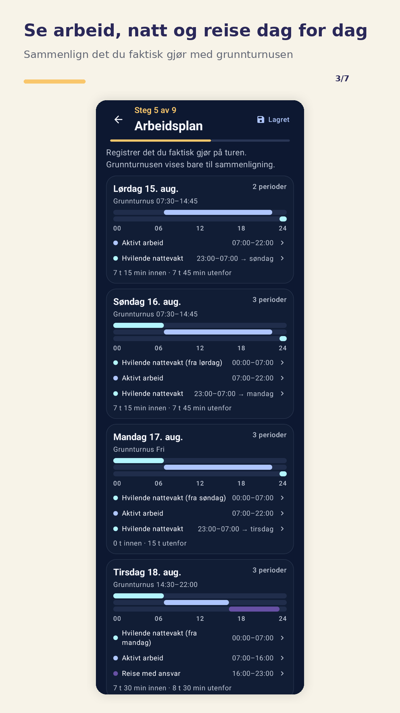
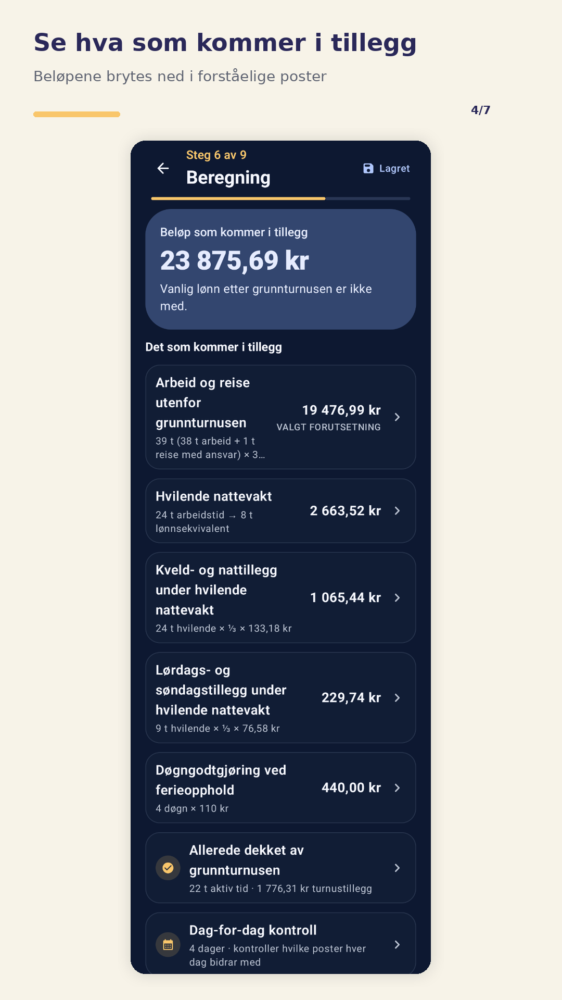
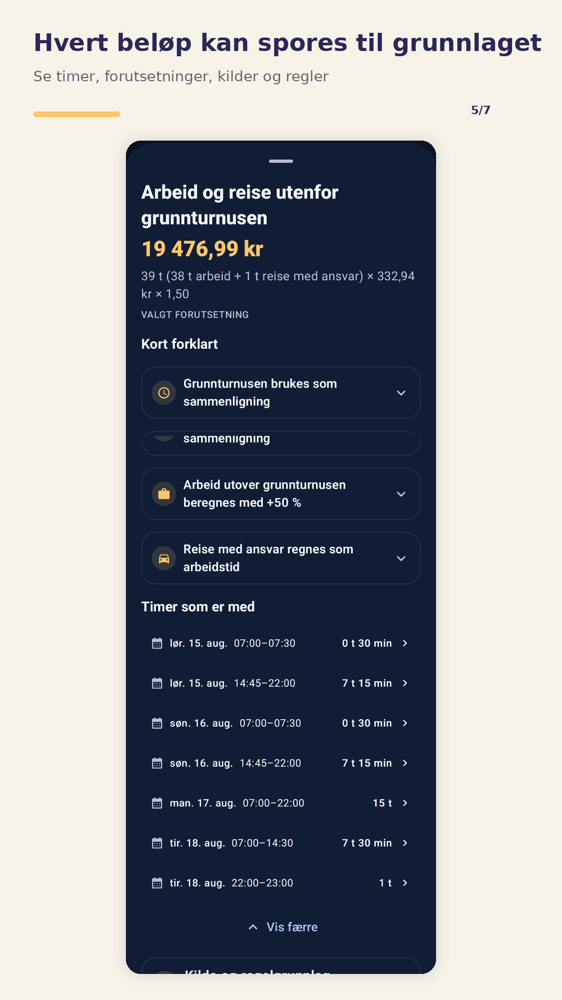
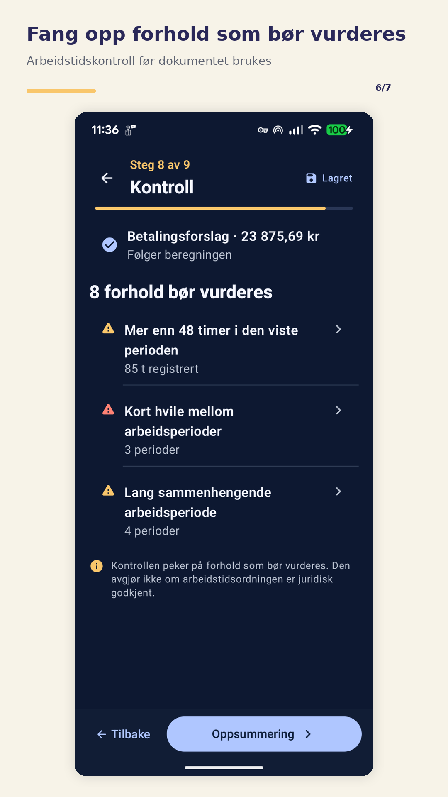
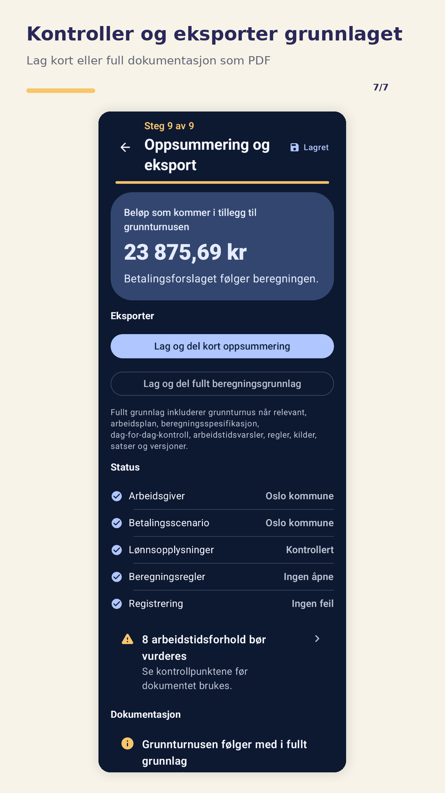

<div align="center">


# Ferietur

**Planlegging, beregning og dokumentasjon for ferieturer der ansatte følger med.**

[](https://github.com/brealorg/ferietur/releases/tag/v0.5.6)


## [⬇ Last ned Ferietur 0.5.6](https://github.com/brealorg/ferietur/releases/download/v0.5.6/Ferietur-0.5.6.apk)

**Android APK · Android 8.0 eller nyere**

[Release notes](https://github.com/brealorg/ferietur/releases/tag/v0.5.6) · [Personvern](https://brealorg.github.io/ferietur/privacy/) · [Rapporter en feil](https://github.com/brealorg/ferietur/issues)

</div>

> [!IMPORTANT]
> **Ferietur er et uavhengig planleggings- og beregningsverktøy.** Appen er ikke utviklet av, godkjent av eller en offisiell tjeneste fra Oslo kommune eller andre offentlige myndigheter. Beregningene erstatter heller ikke gjeldende tariffavtale, arbeidsgivers vurdering eller ordinær lønnskontroll.

## Hvorfor Ferietur?

Når en person er avhengig av at ansatte blir med for å kunne reise på ferie, blir en vanlig ferietur fort også et spørsmål om **turnus, reisetid, arbeidstid, natt, tillegg, ansvar og betaling**.

Ferietur samler disse opplysningene i én strukturert turplan og bygger et beregningsgrunnlag som kan **forklares, kontrolleres og dokumenteres**.

Målet er ikke bare å produsere et sluttbeløp, men å gjøre det synlig **hva som er beregnet, hvorfor og på hvilket grunnlag**.

## Hva appen gjør

- planlegger turen dag for dag
- registrerer reise, arbeid og relevante tidsperioder
- håndterer arbeid på dag, kveld og natt, inkludert hvilende nattevakt og aktivt arbeid
- bygger opp et forklarbart lønns- og betalingsgrunnlag
- støtter ulike oppsett for turnus og separat oppdrag
- lagrer turer og utkast lokalt på enheten
- lager PDF med beregning, forutsetninger og regelinformasjon
- lar brukeren gå tilbake og kontrollere grunnlaget før noe ferdigstilles

<!-- FERIETUR_SCREENSHOTS_START -->
## Skjermbilder

Ekte skjermbilder fra Ferietur på Android.

<p align="center">
  
  
  
</p>

<p align="center">
  
  
  
</p>

<p align="center">
  
</p>
<!-- FERIETUR_SCREENSHOTS_END -->

## Typisk arbeidsflyt

1. **Opprett turen** – datoer, reiseforløp og grunnoppsett.
2. **Registrer arbeid og ansvar** – hva som faktisk skjer gjennom turen.
3. **Kontroller lønnsgrunnlaget** – blant annet mot nyere lønnsslipp.
4. **Se beregningen** – med synlige forutsetninger og regelgrunnlag.
5. **Lag PDF-dokumentasjon** – som grunnlag for videre kontroll og avklaring.

## Viktig om beregningene

Ferietur er laget for å gjøre kompliserte beregninger mer etterprøvbare, men appen kan ikke vite om lokale avtaler, nye tariffendringer eller arbeidsgivers konkrete vurdering endrer resultatet.

Kontroller derfor alltid:

- lønnsopplysninger mot en nyere lønnsslipp
- at satsene og reglene fortsatt gjelder for den aktuelle perioden
- at arbeidstid, reise og ansvar er registrert slik de faktisk er avtalt og gjennomført
- at beregningsgrunnlaget samsvarer med gjeldende tariff- og arbeidsrettslige regler

## Personvern

Ferietur er laget for lokal bruk:

- turer og utkast lagres lokalt på enheten
- appen har ingen nettverkstillatelse
- Android-backup og enhetsoverføring er deaktivert
- eksporterte PDF-er deles bare når brukeren selv velger å dele dem
- det kreves ingen konto eller innlogging

[**Les personvernerklæringen**](https://brealorg.github.io/ferietur/privacy/)

## Last ned Ferietur

### Android APK — 0.5.6

[**⬇ Last ned Ferietur-0.5.6.apk**](https://github.com/brealorg/ferietur/releases/download/v0.5.6/Ferietur-0.5.6.apk)

**Android 8.0 eller nyere (API 26+)** · `versionCode 53` · permanent signert produksjonsutgave

Har du allerede Ferietur installert, kan `0.5.6` installeres direkte over en tidligere versjon med samme permanente signeringsidentitet. Lagrede turer og utkast beholdes ved vanlig oppdatering.

[Se release notes](https://github.com/brealorg/ferietur/releases/tag/v0.5.6) · [Se alle releases](https://github.com/brealorg/ferietur/releases)

> Google Play-versjonen er i closed testing. Den direkte signerte APK-en publiseres parallelt for manuell installasjon og oppdatering.

<details>
<summary><strong>Verifiser APK og signeringsidentitet</strong></summary>

### APK SHA-256

```text
aa00be289a95f01f5abcdde1d3a4be97bc004ea9b7c545c06d243534211348ef
```

### Permanent signeringssertifikat SHA-256

```text
9bc0c2925d6bad3947cbcf6c237d6d085aebf5cb54f67170622ce02f8e8252e7
```

Checksum og sertifikatfingeravtrykk ligger også som egne filer i releasen.

</details>

## Release 0.5.6

`0.5.6` er en kvalitetssikrings- og dokumentasjonsoppdatering med særlig fokus på arbeidstid og etterprøvbarhet.

Blant endringene:

- arbeidstidskontrollen finner nå høyeste registrerte arbeidstid i løpet av en hvilken som helst sju-dagersperiode, i stedet for å bruke hele turens total
- tydeligere og mer kompakt arbeidstidsoversikt i PDF
- bedre klarspråk i kontrollfunn og forklaringer
- sterkere kildesporing og presentasjon av tariff- og beregningsgrunnlaget
- flere regresjonstester og kvalitetssikringer

Den direkte APK-en beholder den permanente signeringsidentiteten fra tidligere utgaver. Google Play-versjonen distribueres separat gjennom closed testing.

Se [release notes for 0.5.6](https://github.com/brealorg/ferietur/releases/tag/v0.5.6) for den publiserte releasepakken.

## Status

| Spor | Status |
|---|---|
| Signert Android APK | ✅ Publisert |
| Permanent update-signatur | ✅ Etablert |
| Lokal lagring / PDF | ✅ Produksjon |
| Google Play | 🧪 Closed testing |
| Kildekodepublisering | Ikke besluttet |

## Kildekode og lisens

Kildekoden er **ikke publisert som del av 0.5.6-utgivelsen**. Repositoryet har derfor foreløpig ingen åpen kildekode-lisens, og det gis ikke noen generell lisens til å kopiere, endre eller redistribuere prosjektets egen kildekode.

Kildekodepublisering og valg av programvarelisens behandles separat før eventuell kildekode legges ut.

## Tilbakemeldinger

Har du funnet en feil eller noe som er uklart, bruk [GitHub Issues](https://github.com/brealorg/ferietur/issues).

Når du rapporterer beregningsfeil, beskriv gjerne **hvilket oppsett du valgte, hvilke tidsperioder som ble registrert og hvilket resultat du forventet**. Ikke legg ved personopplysninger eller sensitive opplysninger fra faktiske brukere.
