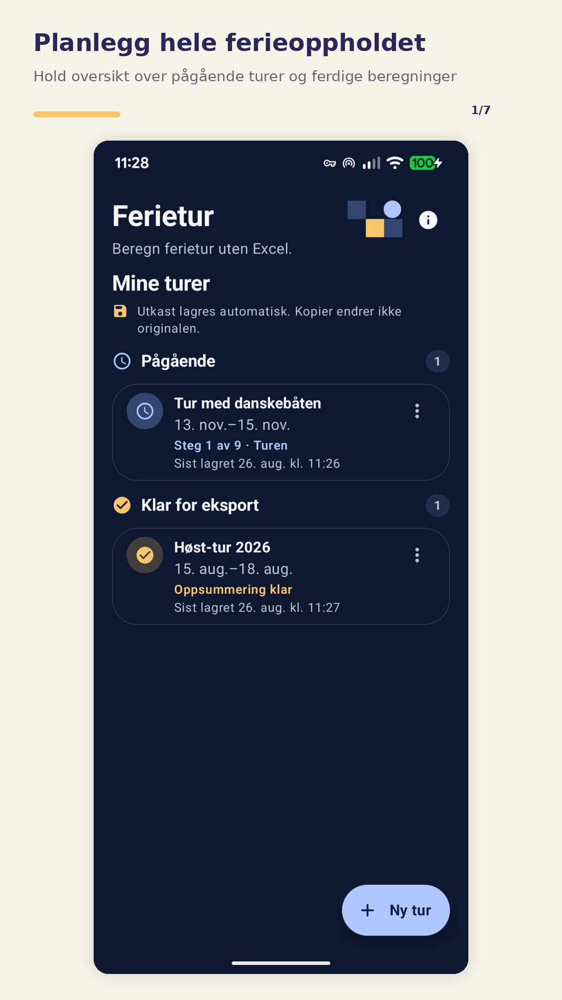
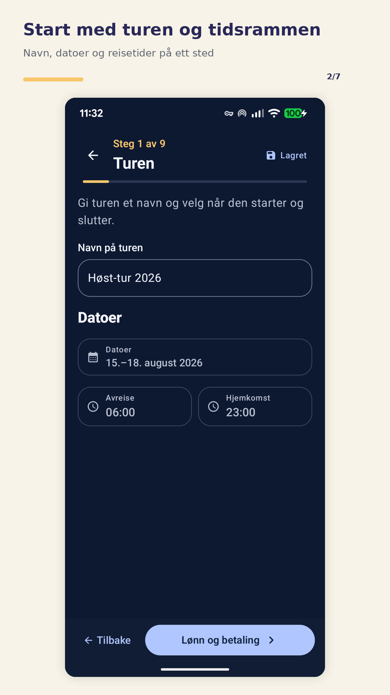
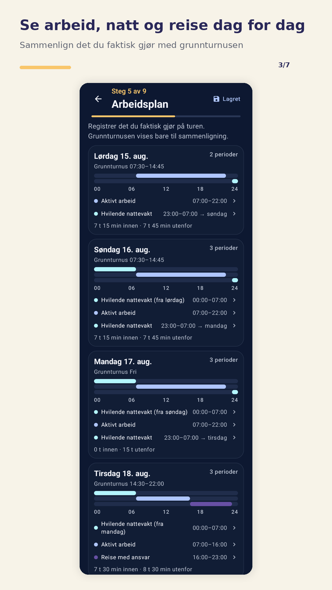
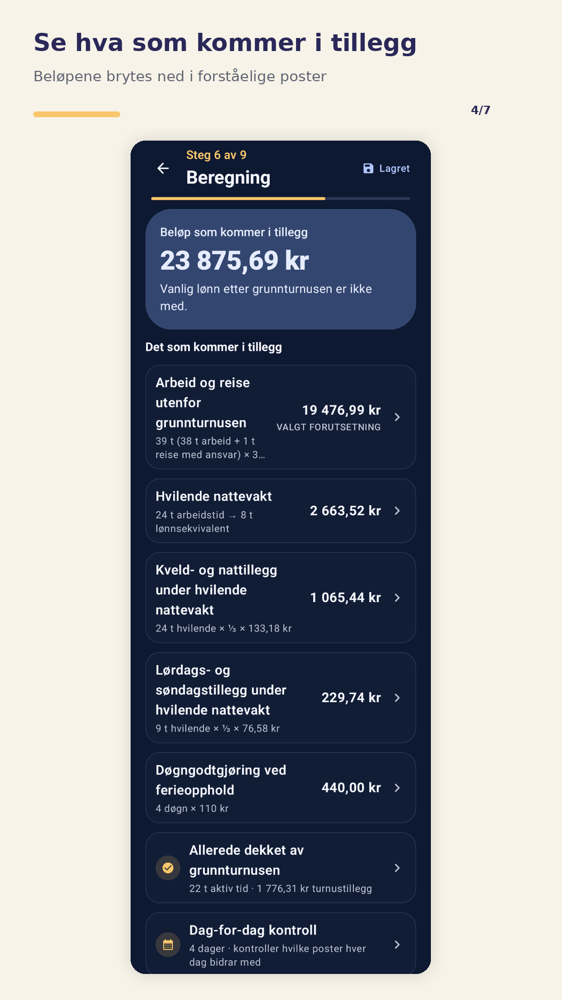
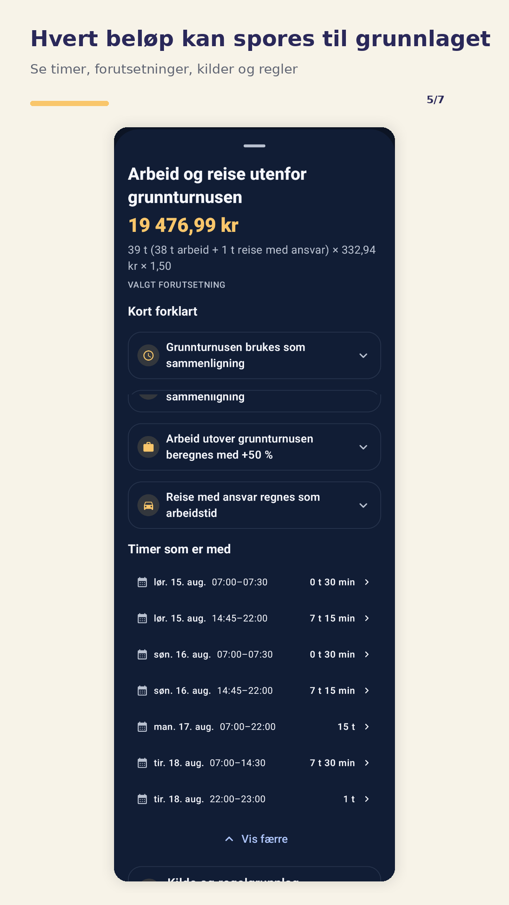
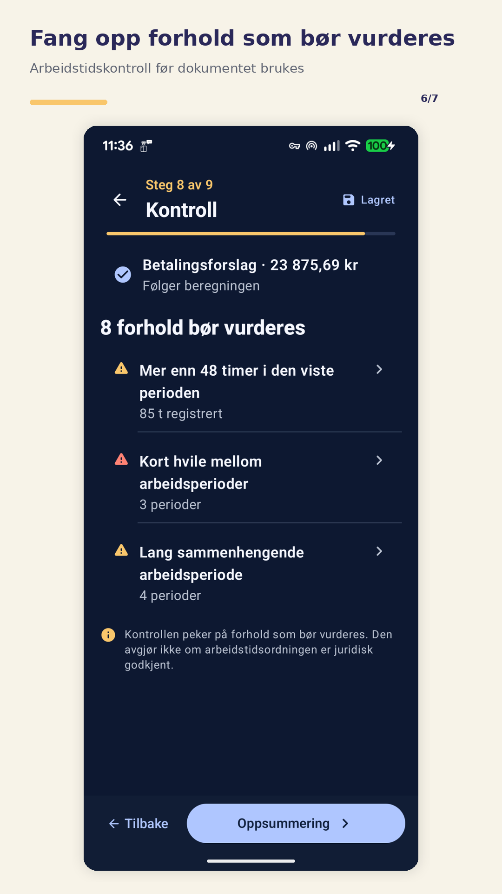
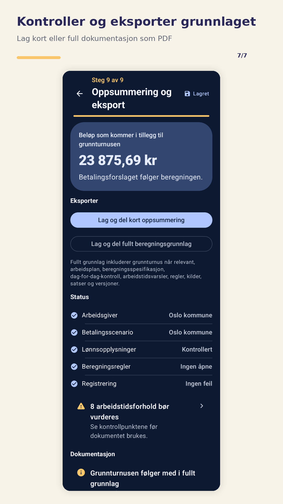

<div align="center">


# Ferietur

**Planlegging, beregning og dokumentasjon for ferieturer der ansatte følger med.**

**Gjeldende kildekode:** `0.6.2` (`versionCode 56`) · **Siste publiserte APK:** `0.6.2` (`versionCode 56`)

[](https://github.com/brealorg/ferietur/releases/tag/v0.6.2)


## [⬇ Last ned Ferietur 0.6.2](https://github.com/brealorg/ferietur/releases/download/v0.6.2/Ferietur-0.6.2.apk)

**Android APK · Android 8.0 eller nyere**

[**▶ Hent Ferietur på Google Play**](https://play.google.com/store/apps/details?id=app.ferietur)

[Release notes](https://github.com/brealorg/ferietur/releases/tag/v0.6.2) · [Personvern](https://brealorg.github.io/ferietur/privacy/) · [Rapporter en feil](https://github.com/brealorg/ferietur/issues)

</div>

> [!IMPORTANT]
> **Ferietur er et uavhengig planleggings- og beregningsverktøy.** Appen er ikke utviklet av, godkjent av eller en offisiell tjeneste fra Oslo kommune eller andre offentlige myndigheter. Beregningene erstatter heller ikke gjeldende tariffavtale, arbeidsgivers vurdering eller ordinær lønnskontroll.

## Hvorfor Ferietur?

Når en person er avhengig av at ansatte blir med for å kunne reise på ferie, blir en vanlig ferietur fort også et spørsmål om **turnus, reisetid, arbeidstid, natt, tillegg, ansvar og betaling**.

Ferietur samler disse opplysningene i én strukturert turplan og bygger et beregningsgrunnlag som kan **forklares, kontrolleres og dokumenteres**.

Målet er ikke bare å produsere et sluttbeløp, men å gjøre det synlig **hva som er beregnet, hvorfor og på hvilket grunnlag**.

## Hva appen gjør

- planlegger turen dag for dag
- registrerer reise, arbeid og relevante tidsperioder
- håndterer arbeid på dag, kveld og natt, inkludert hvilende nattevakt og aktivt arbeid
- bygger opp et forklarbart lønns- og betalingsgrunnlag
- støtter ulike oppsett for turnus og separat oppdrag
- lagrer turer og utkast lokalt på enheten
- lager PDF med beregning, forutsetninger og regelinformasjon
- lar brukeren gå tilbake og kontrollere grunnlaget før noe ferdigstilles

<!-- FERIETUR_SCREENSHOTS_START -->
## Skjermbilder

Ekte skjermbilder fra Ferietur på Android.

<p align="center">
  
  
  
</p>

<p align="center">
  
  
  
</p>

<p align="center">
  
</p>
<!-- FERIETUR_SCREENSHOTS_END -->

## Typisk arbeidsflyt

1. **Opprett turen** – datoer, reiseforløp og grunnoppsett.
2. **Registrer arbeid og ansvar** – hva som faktisk skjer gjennom turen.
3. **Kontroller lønnsgrunnlaget** – blant annet mot nyere lønnsslipp.
4. **Se beregningen** – med synlige forutsetninger og regelgrunnlag.
5. **Lag PDF-dokumentasjon** – som grunnlag for videre kontroll og avklaring.

## Viktig om beregningene

Ferietur er laget for å gjøre kompliserte beregninger mer etterprøvbare, men appen kan ikke vite om lokale avtaler, nye tariffendringer eller arbeidsgivers konkrete vurdering endrer resultatet.

Kontroller derfor alltid:

- lønnsopplysninger mot en nyere lønnsslipp
- at satsene og reglene fortsatt gjelder for den aktuelle perioden
- at arbeidstid, reise og ansvar er registrert slik de faktisk er avtalt og gjennomført
- at beregningsgrunnlaget samsvarer med gjeldende tariff- og arbeidsrettslige regler

## Personvern

Ferietur er laget for lokal bruk:

- turer og utkast lagres lokalt på enheten
- appen har ingen nettverkstillatelse
- Android-backup og enhetsoverføring er deaktivert
- eksporterte PDF-er deles bare når brukeren selv velger å dele dem
- det kreves ingen konto eller innlogging

[**Les personvernerklæringen**](https://brealorg.github.io/ferietur/privacy/)

## Last ned Ferietur

### Android APK — 0.6.2

[**⬇ Last ned Ferietur-0.6.2.apk**](https://github.com/brealorg/ferietur/releases/download/v0.6.2/Ferietur-0.6.2.apk)

**Android 8.0 eller nyere (API 26+)** · `versionCode 56` · permanent signert produksjonsutgave

Har du allerede Ferietur installert, kan `0.6.2` installeres direkte over en tidligere versjon med samme permanente signeringsidentitet. Lagrede turer og utkast beholdes ved vanlig oppdatering.

[Se release notes](https://github.com/brealorg/ferietur/releases/tag/v0.6.2) · [Se alle releases](https://github.com/brealorg/ferietur/releases)

> Ferietur er også tilgjengelig på [Google Play](https://play.google.com/store/apps/details?id=app.ferietur) (Norge). Den direkte signerte APK-en publiseres parallelt for manuell installasjon og oppdatering. De to sporene har ulik signeringsidentitet og kan ikke oppdatere hverandre; velg ett spor per enhet.

<details>
<summary><strong>Verifiser APK og signeringsidentitet</strong></summary>

### APK SHA-256

```text
2e50c92996f1ab562b39fa816cbd6262413bf92ba07e34048903e8cbf1bd4972
```

### Permanent signeringssertifikat SHA-256

```text
9bc0c2925d6bad3947cbcf6c237d6d085aebf5cb54f67170622ce02f8e8252e7
```

Checksum og sertifikatfingeravtrykk ligger også som egne filer i releasen.

</details>

## Release 0.6.2

`0.6.2` er en utseende- og vedlikeholdsutgave. **Ingen beregninger er endret.**

Blant endringene:

- nytt appikon: kofferten har fått en bagasjelapp og står på Oslo gul; ikonet holder seg innenfor sikkerhetssonen for runde ikonmasker, og den tematiserte varianten er oppdatert
- Ferieturs eget merke vises på forsiden, under «Om Ferietur» og i toppen av hver PDF-side, i stedet for grafikk i Oslo kommunes mønsterspråk
- roligere lagringsstatus i veiviseren: en liten hake når utkastet er lagret, tydelig varsel og «prøv på nytt» bare når lagring feiler
- hjelpeteksten om arbeidsplan i steg 2 klippes ikke lenger av kortets hjørne
- varselet om mer enn 48 timer på sju dager viser timer og periode i stedet for å gjenta tittelen
- `gradle/verification-metadata.xml` dekker nå oppslagsfilene en tom Gradle-cache leser, slik at CI og en nyinstallert maskin bygger uten manuelle tillegg

Bakgrunn og detaljer står i [docs/ICON02_LUGGAGE_TAG.md](docs/ICON02_LUGGAGE_TAG.md) og [docs/BRAND01_IN_APP_MARK.md](docs/BRAND01_IN_APP_MARK.md).

Den direkte APK-en beholder Ferieturs permanente signeringsidentitet og installeres over tidligere versjoner med bevart appdata.

Google Play-sporet håndteres separat.

Se [release notes for 0.6.2](https://github.com/brealorg/ferietur/releases/tag/v0.6.2) for den publiserte releasepakken.

### Google Play release notes (no-NO)

Lim inn i Play Console nøyaktig slik, taggene inkludert (ca. 300 tegn, grensen er 500):

```
<no-NO>
Ingen beregninger er endret.

• Nytt appikon og eget Ferietur-merke i appen og i PDF-ene
• Roligere lagringsstatus: en liten hake når alt er lagret, tydelig varsel bare hvis lagring feiler
• Småretting i steg 2 og 8

Ferietur er et uavhengig hjelpeverktøy og ikke en offisiell tjeneste fra Oslo kommune.
</no-NO>
```

## Status

| Spor | Status |
|---|---|
| Signert Android APK | ✅ Publisert |
| Permanent update-signatur | ✅ Etablert |
| Lokal lagring / PDF | ✅ Produksjon |
| Google Play | ✅ Publisert i produksjon (Norge) |
| Kildekodepublisering | ✅ Publisert |

## Kildekode og lisens

Ferietur er fri programvare, lisensiert under [GNU General Public License v3.0](LICENSE) (`GPL-3.0-only`).

Du kan bruke, studere, endre og dele koden videre. Deler du en endret versjon, må også den være åpen under samme lisens, slik at beregningene fortsatt kan etterprøves. Programmet leveres uten noen form for garanti – se lisensen for detaljer.

Navnet **Ferietur** og app-ikonet er ikke omfattet av lisensen. En endret versjon som distribueres videre, må bruke et annet navn og ikon, slik at den ikke kan forveksles med denne appen.

Copyright © 2026 brealorg

## Tilbakemeldinger

Har du funnet en feil eller noe som er uklart, bruk [GitHub Issues](https://github.com/brealorg/ferietur/issues).

Når du rapporterer beregningsfeil, beskriv gjerne **hvilket oppsett du valgte, hvilke tidsperioder som ble registrert og hvilket resultat du forventet**. Ikke legg ved personopplysninger eller sensitive opplysninger fra faktiske brukere.
